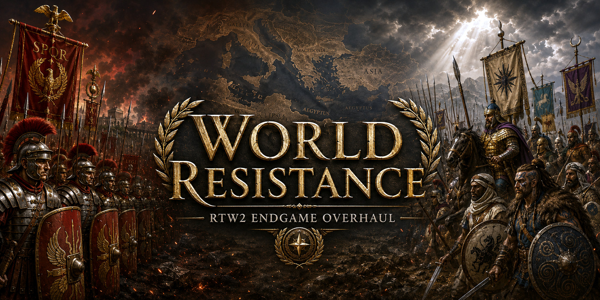

# World Resistance for Total War: ROME II

World Resistance is a standalone anti-steamroll campaign mod. As the human empire grows, **every active AI faction** receives stronger economic, military, research, stability, and diplomatic support. War status, alliance status, client status, diplomatic contact, culture, and distance do not affect eligibility.

The intended end state is deliberately unfair: once the human is a hegemon, the rest of the world can build, recruit, replenish, research, and finance near-peer armies at extreme speed, while AI factions increasingly cooperate with one another.

> **Release status: 0.1.8 pre-PANTHEON beta.** Release 0.1.7 passed the native Diplomacy-panel crash retest and a short maximum-pressure playtest. Release 0.1.8 preserves that live-stable activation and diplomacy path and adds one narrow settlement-development aid: once per campaign turn, each active AI province receives tier-scaled development points through one representative owned region. The existing DB and localization payloads are unchanged. It targets only the current public original Grand Campaign (`main_rome`) as researched through 2026-07-20; read [Compatibility and testing](docs/COMPATIBILITY_AND_TESTING.md) before using it in a campaign you care about.

## Theory: why the numbers are deliberately broken

World Resistance began with a familiar Total War problem: once the player survives the opening and becomes the dominant power, the campaign is effectively over long before the victory screen appears. The remaining turns become a march from settlement to settlement—fighting inferior armies, pressing auto-resolve, and painting the map. Rome may still have enemies, but it no longer has peers. The same basic failure can appear even in later Total War campaigns such as *Three Kingdoms*: once the decisive wars are won, crossing the rest of the map can become procedure rather than strategy.

There are two broad ways to attack that problem. One is to make a large empire harder to administer. Mods such as Divide et Impera do this through deeper logistics, supply, public order, politics, and other pressures inside the player's empire. That is a legitimate approach, but it is not the goal here.

> World Resistance does not try to make expansion tedious. It tries to make success strategically expensive.

This mod is less interested in making provincial bookkeeping the final boss. It is trying to create more endgame strategy—and more opportunities to use the expensive, fully upgraded armies that Rome II gives the player shortly before it stops giving them worthy opponents. The desired endgame is maximized armies fighting maximized armies: Praetorian Guard, elite cavalry, veteran generals, top-tier equipment, developed cities, and late-game technologies should matter because the other side can answer them. The campaign should culminate in wars of maneuver and attrition, not elite Roman stacks erasing half-strength levy armies from factions that never escaped the early game.

### Scaling the opposition instead of weakening the player

The core idea is enemy scaling. In many modern games, the opposition grows as the player grows. Grand-strategy games more often rely on fixed difficulty bonuses, administrative penalties, scripted crises, or ordinary coalitions. Those systems can slow a snowball, but they do not necessarily keep every surviving opponent developing in proportion to the player.

World Resistance reverses Rome II's normal relationship between success and difficulty. As the human empire becomes more powerful, the rest of the world becomes more capable. This applies to every eligible AI faction, not merely factions already at war with the player. They do not wait for Rome to attack before preparing. Once a hegemon is emerging, “Rome is coming” is a reasonable strategic assumption.

The Resistance score translates human expansion and power into progressively stronger AI support. Territory is the main signal because territory is the clearest measure of a growing hegemon; field armies and treasury provide smaller secondary signals. The response touches the useful levers Rome II actually exposes: income, treasury reserves, construction, research, public order, food, recruitment and upkeep costs, unit quality, replenishment, legal army capacity, and AI-to-AI diplomacy.

The purpose is not to create a mathematically identical copy of the player. It is to give every surviving faction enough economic, technological, and military capacity to remain relevant before the player reaches its border. A one-region faction is not ordered to spam 16 armies—the mobilization goal is geographically bounded—but it is given the means to develop, recruit, and recover instead of waiting in poverty to become Rome's next conquest.

### Why Resistance 100 looks absurd

At maximum pressure, the tables look completely broken because the strategic position is already completely broken in the player's favor.

By Resistance 100, the human controls an enormous share of the map, possesses mature infrastructure, can concentrate forces intelligently, and has already demonstrated the ability to defeat the campaign AI repeatedly. The player is also better at preserving veterans, selecting targets, composing armies, exploiting openings, coordinating fronts, and deciding where resources matter. Numerical equality therefore does not create practical equality. A modest ten- or twenty-percent AI bonus cannot close that gap.

The extreme bonuses compensate for those asymmetries. They are not a claim that a small kingdom should realistically generate millions of denarii, finish monumental buildings in a year, or recover from disaster with impossible speed. They are an admission that the human and the AI are playing the strategic game at different levels. By the time the player owns half the known world, preserving realism at the cost of every remaining meaningful decision is not a worthwhile trade.

The relevant balance is not “Is this one-city faction receiving a fair bonus?” It is “Can the surviving world, taken together, still impose hard choices on a hegemonic player?” At maximum pressure the world itself becomes the endgame opponent.

### The anti-hegemonic response

Economic scaling is not enough. If AI factions continue exhausting themselves in unrelated wars, Rome can defeat them one at a time. World Resistance therefore couples material scaling with an anti-hegemonic diplomatic response.

As resistance rises, AI factions become increasingly cooperative with one another. At the highest tiers, the system acts only on AI-to-AI relationships, in both directions: it suppresses their wars, protects agreements, and repeatedly promotes their campaign-AI stance to `BEST_FRIENDS`. Trade, peace, non-aggression pacts, and alliances are enabled and protected, although Rome II still decides whether formal alliances are actually signed. None of these controls makes the AI friendlier to the human.

That promotion is strategic guidance, not a numeric relations rewrite. Historical grievances can remain visible in the Diplomacy panel, and the mod does not claim to add a hidden `+300` affinity modifier. The goal is to make cooperation strategically available and persistent without forcing Rome II's native diplomacy state into a combination its UI cannot safely read.

The surviving factions do not need to forget every historical feud or acquire an artificial hatred of Rome. They only need to recognize that fighting one another while a hegemon can conquer all of them is strategically suicidal. This coalition turns raw bonuses into a genuine strategic problem: one border war can widen into multiple fronts, allied reinforcements, naval threats, agents, and replacement armies. Expansion creates power, but it also creates exposure and more directions from which a coordinated world can respond.

### Attrition must matter again

The intended result is not an unwinnable campaign. It is a campaign in which victory continues to demand attention.

If the player sacrifices several veteran legions through a careless offensive, that loss should reshape the next phase of the war. Replacing troop cards is not the same as replacing experienced armies, trusted generals, secure frontier positions, or lost strategic momentum. Recovering from a major mistake may take many turns—potentially a decade of campaign time—while opponents use their accelerated economies to rebuild much faster.

That imbalance is deliberate. The player has judgment; the AI has production. The player wins through preparation, concentration of force, diplomacy, positioning, target selection, and superior battlefield command. The AI remains dangerous because it can absorb losses and return with another serious army.

World conquest should therefore feel like a centuries-long endgame rather than an extended victory lap. Progress may require breaking coalitions, choosing defensible frontiers, destroying armies rather than merely taking settlements, managing simultaneous wars, and knowing when to stop an offensive before success becomes overextension. The goal is to make conquering the final half of the map a different strategic problem from conquering the first half—not merely a longer version of the same march.

### Working with Rome II's boundaries

The final design was shaped as much by Rome II's technical boundaries as by the original idea. The campaign API does not safely offer every lever one might want. There is no low-risk, audited path for dynamically creating coherent elite armies through normal recruitment, no safe pair-specific `+300` relations setter, no direct constructor for an alliance, and no faction-specific dynamic army-cap setter tied to settlement count. Broad building, roster, or CAI-personality rewrites would increase crash and compatibility risk and could also affect the human.

World Resistance therefore works through narrower, audited systems: faction effect bundles, treasury support, the legal Grand Campaign army ceiling, accelerated normal development, and pair-scoped diplomatic controls. It does not spawn armies, globally unlock every culture's roster, prescribe unit composition, or replace the campaign AI. AI factions still recruit their own units, use their own buildings, and make their own decisions. The mod gives them the means to become formidable and strongly discourages them from casually dismantling the coalition that makes the endgame work.

The result is intentionally artificial but strategically honest. World Resistance does not pretend that Rome II's late campaign remains competitive on its own. It asks a different question: once the player has mastered the game, what would the world need in order to keep the campaign interesting?

The answer is a richer, faster, better-armed, and increasingly united opposition—one strong enough to make Rome earn the rest of the map.

## What it does

- Scales all living, active non-human factions from turn one. There is no frontline, enemy, ally, client, contact, or distance exception.
- Uses the human share of world territory as the primary pressure signal. Human estimated field-army count and treasury are smaller secondary signals. Live Rome II evidence showed that `has_general()` cannot distinguish field armies from settlement garrison forces, so 0.1.8 retains 0.1.7's `main_rome` estimate: broad land-army forces minus one garrison force per owned region, clamped at zero.
- Establishes a permanent endgame pressure floor when the human reaches final vanilla Imperium, then keeps scaling with territory until maximum pressure at roughly 70% of the map.
- Gives each AI exactly one global pressure bundle and, when it is behind, one additional catch-up bundle based on its worst shortfall in regions, armies, or treasury.
- Adds 0 / 0 / 1 / 1 / 2 / 3 development points per AI-owned province per campaign turn at Tiers 0 / 20 / 40 / 65 / 85 / 100. Each unique province is processed once, regardless of how many settlements it contains, and human provinces are never targeted.
- Raises AI treasuries toward human-relative and replacement-reserve floors. The script only adds funds; it never removes them.
- Gives Grand Campaign AI access to the final legal 16-army cap from the start while retaining the human's normal Imperium thresholds and 3-to-16 progression. Each AI's mobilization comparison target is `min(4 × regions, human parity target, 16)`, so one city does not imply a demand for 16 stacks. It does not spawn armies.
- Makes strategic behavior progressively more cooperative **only between AI factions**. Every processed direction receives the tier-appropriate stance promotion, reaching `BEST_FRIENDS` at the high tiers. Protected agreements, blocked ordinary war/join-war offers, repeated peace enforcement, and top-tier legal trade attempts remain in place. No hard stance lock or forced native refresh is used.
- Never makes the AI friendlier to the human and never applies a World Resistance bundle or diplomatic command to a human faction.
- Shows a native Rome II campaign message after the first successful reconciliation and at each new resistance-tier high.
- Writes structured, local-only diagnostics to `data/wr2_world_resistance.log`; both local logs rotate at 1,000 lines and nothing is transmitted or uploaded.

At maximum pressure, a severely behind AI receives the Tier 100 package plus Catch-up 3:

| System | Maximum contribution from this mod |
|---|---:|
| Construction time | -7 turns |
| Construction, recruitment, normal upkeep, and mercenary costs | -90% each |
| Building GDP / tax | +600% / +150% |
| Land / naval recruitment capacity | +12 / +9 |
| Replenishment | +50 percentage points |
| Recruit rank / armour / morale | +9 / +10 / +10 |
| Melee damage / experience gain | +10% / +15% |
| Research | +600% and +375 flat points |
| Public order / food / growth | +400 / +5000 / +35 |
| Province development points | +3 per AI-owned province per campaign turn |

Development points supply the population/development surplus that CAI needs to unlock more construction. They do **not** choose a building, bypass faction or culture prerequisites, instantly upgrade an existing Level 1 structure, or guarantee that CAI will spend the points well. The feature is deliberately narrower than a global `building_levels` or CAI-personality rewrite, which would also affect the human and greatly increase the compatibility surface.

This does not guarantee that the campaign AI will make perfect decisions or choose an ideal elite roster. It gives every AI the legal capacity, money, throughput, resilience, development surplus, and diplomatic protection needed to remain dangerous. It does not unlock faction-ineligible units, spawn forces, prescribe rosters, or replace CAI budget/personality tables.

Rome II's diplomacy power bar primarily reflects military forces already fielded. World Resistance does **not** create armies or instantly fill existing armies with units, so that bar is not an immediate activation indicator. Once reconciliation succeeds, recruitment capacity, cost, rank, replenishment, treasury, and the legal army cap let every AI build toward parity through normal campaign recruitment. A weak faction—especially in a save that began without WR—can therefore remain visibly weak for several turns while mobilizing.

## Installation

1. Close Rome II.
2. Remove or move **every older World Resistance pack** from the game's `data` directory. In particular, remove the 0.1.1 file named `wr2_world_resistance.pack`; do not leave both releases installed.
3. Copy `@wr2_world_resistance.pack` from `dist` into the game's `data` directory, normally:

   ```text
   ...\Steam\steamapps\common\Total War Rome II\data
   ```

   The leading `@` is intentional and is part of the exact filename.
4. Open the Rome II launcher and enable **only** `@wr2_world_resistance.pack` for the clean first test.
5. Keep the original release archive so you can restore the exact build used by a save.

No other gameplay or framework mod is required. “Standalone” means all World Resistance mechanics are in this one pack; it does not mean the pack can safely coexist with every overhaul. In particular, do not enable another pack that replaces `lua_scripts/all_scripted.lua`, and avoid army-cap or `fame_levels` mods. See the [compatibility matrix](docs/COMPATIBILITY_AND_TESTING.md#compatibility-matrix).

The **No Civil War** and **Stable Politics** mods are DB-only and do not replace World Resistance's Lua loader, so they are compatible with WR's activation path. Leave them disabled for the clean smoke test, then re-enable them after WR has passed it.

## Recommended first run

With the game closed, first move or delete any old WR logs so the new session is unambiguous. Enable only `@wr2_world_resistance.pack`, then launch a disposable Grand Campaign or a **copy** of an existing `main_rome` save. Confirm that the activation message appears, inspect both logs described below, end one turn, save and load, and return from a battle. Then run several AI turns before adding any other mods.

A copied, mid-flight original Grand Campaign is valid for proving that 0.1.8 attaches and activates. It cannot retroactively give the AI the research, construction, recruitment, or development cycles it missed on earlier turns, however. A new Grand Campaign on Normal campaign difficulty remains the supported balance path for the intended full-campaign experience.

Do not add or remove this beta in the middle of an important campaign. Removing an army-cap override while an AI owns more forces than its restored cap has not been validated.

## How to verify it is running

Release 0.1.8 has two separate, local-only logs. The first starts in the root loader, before the campaign interface exists:

```text
...\Total War Rome II\wr2_world_resistance_bootstrap.log
```

Every bootstrap line includes a `load=<id>` field. That ID groups lines from one evaluation of `all_scripted.lua`, so a rolling file containing several game or campaign loads can be read without guessing where one attempt ends and another begins. The file never exceeds 1,000 lines; when full, it keeps the newest 800 before appending again.

On a normal first setup, one load ID should show the loader route, the explicit event-registry handoff, and six successful listener insertions:

```text
LOADER_START
EVENT_REGISTRY_READY (source=export_triggers)
MODULE_PATH_READY
DIRECTOR_ROUTE_TRY
DIRECTOR_ROUTE_OK
DIRECTOR_REQUIRE_OK
DIRECTOR_SETUP_TRY
EVENT_REGISTRY_READY (source=loader_argument)
LISTENER_OK_LoadingGame
LISTENER_OK_SavingGame
LISTENER_OK_UICreated
LISTENER_OK_FirstTickAfterWorldCreated
LISTENER_OK_FactionTurnStart
LISTENER_OK_FactionLeaderDeclaresWar
LISTENERS_READY
ENGINE_WAIT
DIRECTOR_SETUP_OK
```

`ENGINE_WAIT` at `director_setup` is expected when Rome II has not published its campaign interface yet. A normal block contains two `EVENT_REGISTRY_READY` lines: `source=export_triggers` proves the root loader has the vanilla registry, and `source=loader_argument` proves the director accepted the argument. Their opaque `registry=` values must match. The decisive attachment result is that the **same** load ID reaches `DIRECTOR_REQUIRE_OK`, both matching registry stages, all six `LISTENER_OK_*` stages, `LISTENERS_READY`, and `DIRECTOR_SETUP_OK`. `DIRECTOR_REQUIRE_OK` by itself proves only that the module imported.

World Resistance does not import `EpisodicScripting` early or wait for a special `NewSession` handoff. The root loader temporarily prepends the pack-owned route `script/campaign/wr2/?.lua`, imports `wr2_world_resistance`, and restores Rome II's original `package.path`. It then calls the returned module's `setup` function with the exact local `triggers.events` table. The director registers its six callbacks on that argument; it no longer assumes that a loader-assigned `events` global is visible from the imported module's environment. On later events it reads the `game_interface` already published by Rome II's own campaign script.

As the campaign continues, that same load ID should add event and world milestones such as:

```text
EVENT_HIT_LoadingGame
ENGINE_READY
EVENT_HIT_UICreated
EVENT_HIT_FirstTickAfterWorldCreated
WORLD_ATTEMPT
DIAGNOSTIC_SINK_READY
WORLD_STATE
WORLD_READY
```

A new campaign need not emit `EVENT_HIT_LoadingGame`, and the first event that can see the interface may vary. `FirstTickAfterWorldCreated` is the normal activation point. Every attempt now emits `WORLD_ATTEMPT`; a failed probe is followed by the specific `WORLD_PROBE_FAIL`, `WORLD_UNSUPPORTED`, or `WORLD_NO_HUMAN` reason and then `WORLD_WAIT`. Until initialization succeeds, the first delivered `FactionTurnStart` in each campaign turn retries regardless of whether that event's context faction is human or AI; the world scan itself finds and protects the human. `DIRECTOR_ROUTE_ERROR` or `DIRECTOR_REQUIRE_ERROR` means the protected director import failed. `DIRECTOR_API_ERROR`, `DIRECTOR_SETUP_ERROR`, or `DIRECTOR_SETUP_PARTIAL` means the module imported but listener attachment was not accepted.

The 0.1.4 trace established the loader, exact event-registry handoff, all six listeners, event dispatch, and interface discovery, then exposed its incorrect zero-argument `campaign_name()` call. Release 0.1.5 corrected that predicate and the subsequent live files reached `DIAGNOSTIC_SINK_READY`, `WORLD_STATE`, `WORLD_READY`, `SESSION_START`, `STATE`, and complete faction/pair audits. The activation popup appeared once and did not repeat after a full exit, reload, and another turn. Release 0.1.7 then removed the unsafe native diplomacy mutations introduced by 0.1.6; the user opened the Diplomacy panel without a crash and continued the campaign through turn 211. Release 0.1.8 preserves that live-stable route.

For the clean retest, close Rome II, move or archive the old logs, verify that only the new WR pack is installed and enabled, and start or load a copied original Grand Campaign. New records should identify `0.1.8-beta`. For one load ID, require a successful route, `DIRECTOR_SETUP_TRY`, both matching `EVENT_REGISTRY_READY` stages, six `LISTENER_OK_*` stages, `LISTENERS_READY`, and `DIRECTOR_SETUP_OK`; then require at least one later `EVENT_HIT_...`, `ENGINE_READY`, `WORLD_ATTEMPT`, `WORLD_STATE`, and finally `WORLD_READY`. `DIAGNOSTIC_SINK_READY` confirms the detailed file opened; `DIAGNOSTIC_SINK_ERROR` identifies a real file-sink failure without disabling gameplay. If several load IDs appear, evaluate each ID separately rather than combining milestones from different blocks. Open and close the Diplomacy panel several times before ending the turn; this remains a required native regression boundary.

The second log begins only after the director completes a supported Grand Campaign reconciliation:

```text
...\Total War Rome II\data\wr2_world_resistance.log
```

It writes one `STATE` record per human turn, plus a faction-by-faction audit at session start, tier escalation, and every tenth turn. Each audit now includes a `DIPLOMACY_AUDIT` line between its begin marker and faction rows. A new `SESSION_START` followed by `STATE` and `AI_AUDIT_BEGIN`/`DIPLOMACY_AUDIT`/`AI`/`AI_AUDIT_END` proves that WR reached and processed the campaign world. After that first successful reconciliation, Rome II should also show a **WORLD RESISTANCE ACTIVE** message identifying the current tier. Later messages appear only when the campaign reaches a new tier high, so reloads and temporary tier demotions do not spam the UI.

For example:

```text
WR2|schema=1|event=STATE|release=0.1.8-beta|director=10|campaign=main_rome|turn=42|human=rom_rome|human_regions=61|world_regions=173|map_pct=35|commanded_armies=16|garrison_armies=61|army_units=320|full_armies=16|treasury=245000|imperium=7|pressure=70|floor=65|tier=65|tier_index=3|desired_tier=65|diplomacy_peak=65|active_ai=34|target_armies=16|ai_commanded_armies=90|ai_army_goal=500|ai_full_armies=24|ai_factions_at_army_goal=3|catchup_0=4|catchup_1=8|catchup_2=11|catchup_3=11|base_commands_ok=34|catchup_commands_ok=34|bundle_changes=68|grant_count=31|grant_total=2450000|development_status=accepted|development_points_per_province=1|development_provinces=48|development_commands_ok=48|development_commands_failed=0|development_owner_skips=0|development_points_granted=48|last_development_turn=42|pairs_total=561|pairs_updated=80|pairs_pending=481|army_measure=region_adjusted_estimate|best_friend_promotions_ok=80|diplomatic_calls=1600|peace_commands=0
```

An `AI` record identifies the selected bundles, treasury target/grant, estimated field armies and garrisons, estimated field-army unit total and full stacks, mobilization goal, shortfall, eligible unique provinces, and development-point command totals for each active AI. For `main_rome`, `commanded_armies` is an estimate: broad land-army forces minus one presumed settlement-garrison force per owned region, clamped to zero; `army_measure=region_adjusted_estimate` makes that method explicit. `DIPLOMACY_AUDIT` reports directional AI-to-AI and AI-to-human attitude count/minimum/average/maximum values and accepted cooperation promotions; `cooperation_mode=promotion_only` confirms that it performs no blocker mutation or readback. These are observations and command-acceptance signals. `development_commands_failed` reports contained native-call errors and `development_owner_skips` reports representatives rejected by the final ownership guard; the batch continues where safe. Fields ending in `_commands_ok` mean protected native calls returned without a Lua exception; they do not prove that CAI selected a building or that a settlement upgraded. The bootstrap `WORLD_STATE` summary independently makes the activation boundary visible.

If the bootstrap file is absent, first confirm that the exact `@wr2_world_resistance.pack` is enabled and the old pack is absent; a protected installation root can also prevent that file from opening. If the bootstrap exists but the detailed `data/wr2_world_resistance.log` does not, read the world stages before blaming the path. `DIAGNOSTIC_SINK_READY` or `DIAGNOSTIC_SINK_ERROR` explicitly settles the detailed-file question after reconciliation. Both files have a hard 1,000-line ceiling and retain the newest 800 lines when rotating. If safe line tracking or rewrite fails, that file batch is skipped rather than written blindly; compact traces still go to Rome II's native `out.ting` sink when available, and gameplay continues.

## Design summary

The pressure curve has six bands: 0, 20, 40, 65, 85, and 100. Territory is continuously interpolated between those points rather than waiting for a single Imperium threshold. Tier promotion is immediate; economic tier demotion is slow. Anti-hegemonic diplomacy is a saved high-water mark and never becomes less cooperative later in the campaign.

Full mechanics and numbers are in [Design](docs/DESIGN.md).

## Important limits

- This build is only for the pre-PANTHEON Grand Campaign (`main_rome`). It deliberately becomes inert in other campaigns.
- The forthcoming PANTHEON/JUPITER branch changes Imperium and army-cap assumptions and needs a separate adapter. This pack intentionally encodes the backward-compatible `fame_levels` v4 Grand Campaign row shape found in decoded stable Rome II packs. The RPFM schema also contains later table layouts, but their presence predates PANTHEON and is not evidence that they describe the forthcoming update.
- The ordinary AI-to-AI war path is disabled at high pressure, but a hard-coded campaign incident could bypass normal diplomacy. The script listens for declarations and forces AI peace again; only live soak testing can prove complete coverage.
- The API can enable and protect alliances, but there is no audited Rome II command that instantly creates an alliance. Universal alliance formation is encouraged, not guaranteed.
- At Tier 85 and above, WR promotes every processed AI-to-AI direction to `BEST_FRIENDS`. Promotion guides CAI strategic stance but neither hard-locks native state nor rewrites the Diplomacy panel's historical relation score. Rome II exposes `faction_attitudes()` for audit reads, but no safe pair-specific numeric setter; WR therefore does not claim or fake a visible `+300` modifier.
- The diplomacy power bar measures already-fielded military strength, not WR's treasury, construction, research, or future recruitment capacity. Because WR deliberately does not spawn units or armies, parity develops through accelerated legal recruitment rather than appearing instantly after activation.
- Province development points remove one input bottleneck but do not force CAI construction choices, bypass culture-specific chains, or retroactively upgrade old buildings. A late-save test is therefore not a substitute for a fresh-campaign buildout test.
- The shared `fame_levels` row also carries agent caps. The maximum-pressure playtest produced heavy agent activity, including eight general deaths in one turn, but 0.1.8 does not lower those caps: the same final row governs a max-Imperium human, and no proven faction-only safe cap lever was found. This may become an explicit balance option later.
- `-90%` reducers can stack with campaign difficulty, technologies, traits, or other mods. Normal campaign difficulty is the initial balance target; higher difficulties require a live economy test.
- A protected Lua call can contain a Lua error, but it cannot catch a native engine crash.
- The status message uses a custom English localization file. A non-English installation may display missing/fallback text; that should be cosmetic, but still needs a live locale test.

## Project layout

| Path | Purpose |
|---|---|
| `dist/` | Installable PFH4 mod pack |
| `pack_root/lua_scripts/` | Vanilla-preserving root loader |
| `pack_root/script/campaign/wr2/` | Pack-routed campaign director |
| `config/bundle_matrix.json` | Machine-readable balance contract |
| `db_src/` | Source TSVs used to construct the pack |
| `tests/` | Pure calculation, mocked engine, and PFH4 tests |
| `tools/` | Deterministic pack/build validation utilities |
| `validation/` | Machine-readable build report, RPFM round trips, and test summary |
| `docs/` | Design, compatibility, safety, and source notes |

## Documentation

- [Design](docs/DESIGN.md)
- [Compatibility and testing](docs/COMPATIBILITY_AND_TESTING.md)
- [Observability and local diagnostics](docs/OBSERVABILITY.md)
- [Crash-safety notes](docs/CRASH_SAFETY.md)
- [Research sources](docs/SOURCES.md)
- [Validation report](validation/TEST_REPORT.md)
- [Changelog](CHANGELOG.md)

## Development pathway: bugs, evidence, and lessons

World Resistance was not fixed by finding one mysterious “the mod does not work” bug. Each release crossed one Rome II boundary, produced better evidence, and exposed the next boundary. This history is retained so future maintainers can reproduce the diagnosis instead of restarting from guesswork.

Evidence labels used below:

- **Native:** produced by Rome II itself through logs, UI behavior, or an observed campaign.
- **Static/simulated:** source and API inspection, mocked Lua execution, or pack-structure validation. This is useful evidence, but it is not in-game certification.
- **Artifact:** direct comparison of release files and checksums.

| Version | Observed symptom or evidence | Root cause | Repair and lesson |
|---|---|---|---|
| **0.1.0-beta** | **Static/API evidence.** The initial build passed structural and simulated checks, but it had no dependable native activation trace. | The logger treated `out` as a callable function or fell back to `print`. In Rome II, `out` is a table and the relevant native sink is `out.ting(...)`. | **0.1.1** corrected the API shape and protected every native-log call. **Lesson:** valid Lua and successful mocks do not prove that a host object has the shape assumed by the script. Instrumentation itself must be audited before its silence can mean anything. |
| **0.1.1-beta** | **User observation plus source/load-order diagnosis; later reproduced in simulation.** The pack could be selected while producing no popup, detailed log, or scaling behavior. | The director tried to acquire `scripting.game_interface` during its early import. Rome II had not published the interface yet, so the adapter returned before registering campaign listeners and had no later retry path. Because detailed logging began only after world reconciliation, the same failure removed both the mechanics and their evidence. | **0.1.2** added a bootstrap stream and attempted deferred attachment. **Lesson:** importing a module is not activation, and a diagnostic sink placed downstream of activation cannot diagnose an earlier lifecycle failure by itself. |
| **0.1.2-beta** | **Native bootstrap evidence.** One startup block reached `ENGINE_WAIT` and `DIRECTOR_REQUIRE_OK` without `ENGINE_READY` or `LISTENERS_READY`. A separate fresh Lua state ended with `module 'lua_scripts.wr2_world_resistance' not found`. Because this append-only log had no load token, the two attempts first had to be separated rather than read as one session. | The repair depended on an unverified second `NewSession` callback running after CA published the interface. It also placed the custom director in the engine-owned `lua_scripts` namespace and relied on an ambient module search route that was not stable across Lua states. | **0.1.3** removed the `NewSession` dependency, attached listeners before interface publication, moved the director to a pack-owned path, temporarily supplied that exact route, restored `package.path`, and added a unique `load` token. **Lesson:** do not take ownership of an engine lifecycle module or rely on an implicit module path when an explicit, reversible route is possible. |
| **0.1.3-beta** | **Native bootstrap evidence.** Two independent load IDs reached `MODULE_PATH_READY`, `DIRECTOR_ROUTE_OK`, and `DIRECTOR_REQUIRE_OK`. Both stopped without `LISTENERS_READY` or any `EVENT_HIT_*`. The early `ENGINE_WAIT` was expected and was not the failure. | The root loader held the real `triggers.events` registry, but the imported director attempted to rediscover it through `rawget(_G, "events")`. Rome II did not demonstrate that the loader and imported module shared the same global view. The earlier harness had accidentally hidden this boundary by sharing one global registry. | **0.1.4** introduced `WR.setup(event_registry)` and passed the exact `triggers.events` object as an argument. It also logged registry identities and every listener insertion. **Lesson:** a successful `require` proves only that code executed. Cross-module engine objects should be passed explicitly, and simulations should isolate module environments instead of assuming shared globals. |
| **0.1.4-beta** | **Native bootstrap evidence.** Matching loader/director registry identities, six successful listener insertions, multiple `EVENT_HIT_*` records, and `ENGINE_READY` proved routing, attachment, dispatch, and interface discovery. The same load then stopped at `WORLD_WAIT`, with no `WORLD_READY` or detailed campaign log. | The director called `model:campaign_name()` as a zero-argument string getter. Rome II exposes `campaign_name(key)` as a boolean predicate, so the valid Grand Campaign was rejected before any bundle, treasury, diplomacy, or detailed-log work. The absent detailed file was a downstream symptom, not a separate file-path failure. | **0.1.5** changed the check to `model:campaign_name("main_rome")` and added reasoned world-probe and diagnostic-sink milestones. **Lesson:** diagnose the earliest failed boundary. Once loader, listeners, and interface acquisition are proven, do not keep rewriting them to fix a later world predicate. |
| **0.1.5-beta** | **Native success.** A loaded maximum-pressure Grand Campaign reached `DIAGNOSTIC_SINK_READY`, `WORLD_STATE`, `WORLD_READY`, `SESSION_START`, `STATE`, and complete AI/pair audits. Every active AI received Tier 100 plus Catch-up 3, all 91 surviving AI pairs were processed, AI wars were reconciled, and the popup remained suppressed after a full exit, reload, and turn advance.<br><br>**Native follow-up findings.** Army totals were suspiciously close to settlement counts; peace did not make AI factions visibly like one another; the append-only logs could grow without limit.<br><br>**Artifact finding.** The separately supplied `.pack` and the copy in the ZIP were not identical. | Rome II includes settlement garrisons in the broad force list returned as armies, so `is_army()` alone inflated field-army measurements. The diplomacy layer could stop wars and permit agreements without erasing historical attitude values or promoting the strongest cooperative strategic stance. Logging had no rotation boundary. The exact cause of the pack/ZIP mismatch was not proven, but the release process had not made byte identity a required gate. | **0.1.6** attempted to use `has_general()` to distinguish deployable field armies, added bidirectional `BEST_FRIENDS` hard blocks and forced stance refreshes, bounded both logs at 1,000 lines while retaining the newest 800, and made final pack/ZIP checksum identity a release gate. **Lesson:** a plausible API predicate still needs live semantic validation, and protected Lua calls cannot make unsafe native state safe. |
| **0.1.6-beta** | **Native regression.** The campaign map loaded and completed full maximum-pressure reconciliation, but opening the Diplomacy panel produced a repeatable hard crash. The live audit also still reported implausible army totals: `has_general()` did not separate settlement garrison forces in this Rome II interface. | Relative to the live-stable 0.1.5 path, 0.1.6 added four native stance mutations per processed AI pair: a hard block and forced refresh in each direction. Across an 80-pair batch that was 320 new native calls. It also called the blocker-readback binding with an invalid argument shape. The resulting native diplomacy state survived protected Lua execution but crashed when the UI dereferenced it. | **0.1.7** removes all hard-block, forced-refresh, and blocker-readback calls. It retains bidirectional tier-appropriate stance promotion, AI-only treaty permissions, war/join-war blocking, repeated peace, and top-tier trade. It replaces the failed `has_general()` distinction with a clearly labeled `main_rome` estimate: broad land-army forces minus one garrison force per owned region, clamped. **Lesson:** compare against the last native-stable command profile, and treat UI entry as a separate native crash boundary. |
| **0.1.7-beta** | **Native success.** The Diplomacy panel opened without the 0.1.6 crash, the campaign continued through turns 207–211, AI mobilization and agents were visibly stronger, and the user completed the military victory. Rome expanded from 138 to 148 of 173 regions while active AI fell from 14 to 12. Surviving AI factions received Tier 100 plus Catch-up 3 and treasury targets around 4.8–5.9 million, yet many conquered settlements still contained low-level buildings. | Treasury was not the observed bottleneck. The existing save supplied only four new development cycles before another ten regions were conquered, and WR's growth/construction effects accelerated normal CAI decisions without directly supplying province development points. | **0.1.8** keeps the live-stable 0.1.7 DB, activation, army, and diplomacy paths, then adds tier-scaled AI-only province development points once per campaign turn. **Lesson:** a short late-save stress test can prove activation and crash boundaries, but it cannot reproduce the accumulated buildout of a full campaign. |
| **0.1.8-beta** | **Settlement-development candidate.** Adds one protected `add_development_points_to_region` call per unique AI-owned province, using one representative region, at tier values 0 / 0 / 1 / 1 / 2 / 3. | A saved global last-development-turn prevents duplicate grants after reload or repeated reconciliation in the same campaign turn. Human provinces are excluded. The feature supplies surplus but leaves building choice, prerequisites, and upgrades to CAI. | Retest the exact 0.1.7 crash boundaries, verify development telemetry and same-turn reload deduplication, then run a new Grand Campaign long enough to inspect AI city tiers. **Lesson:** remove a specific input bottleneck with the narrowest faction-targeted API rather than rewriting the global building tree. |

### How to reproduce the diagnostic method

1. Close Rome II, archive both existing WR logs, and remove every older World Resistance pack. Begin with only the candidate `@wr2_world_resistance.pack` enabled.

2. Record the game branch, WR version and SHA-256, campaign key, turn, difficulty, save type, and complete mod list. If testing balance rather than attachment, use a new original Grand Campaign.

3. If testing a release ZIP, extract its pack and compare its SHA-256 with the separately distributed pack before launching. A mismatch is a release failure, not an in-game mystery.

4. Read `wr2_world_resistance_bootstrap.log` by its `load=<id>` value. Never combine milestones from different load IDs merely because their lines share one rolling file.

5. For one load ID, require the loader route, both matching `EVENT_REGISTRY_READY` identities, `DIRECTOR_REQUIRE_OK`, `DIRECTOR_SETUP_TRY`, all six listener successes or valid reuses, `LISTENERS_READY`, and `DIRECTOR_SETUP_OK`. An early `ENGINE_WAIT|detail=director_setup` is normal.

6. Continue the same runtime until it records an `EVENT_HIT_*`, `ENGINE_READY`, `WORLD_ATTEMPT`, `DIAGNOSTIC_SINK_READY`, `WORLD_STATE`, and `WORLD_READY`. Stop at the first missing or failed boundary; later symptoms usually follow from that earlier failure.

7. In `data/wr2_world_resistance.log`, require `SESSION_START` and `STATE`, then inspect the scheduled `AI`, `AI_AUDIT_*`, and `DIPLOMACY_AUDIT` records. Confirm that faction totals reconcile instead of judging activation from the diplomacy power bar alone.

8. Distinguish evidence types. Fields ending in `_ok` normally mean a protected engine command returned without a Lua exception. `best_friend_promotions_ok` reports accepted promotion commands, not numeric affinity or native stance readback; `development_commands_ok` reports accepted development calls, not a verified building upgrade. Army figures are estimates, and army composition, city development, treaties, attitudes, and alliances should also be checked in the campaign UI.

9. End several AI turns, save and reload, return from a battle, and fully restart the game. Confirm that state continues updating, the same tier popup does not repeat, the files remain bounded, and strategic outcomes develop over time.

10. When reporting a failure, preserve both complete logs, the exact pack or its checksum, screenshots of the relevant UI outcome, and the earliest failed milestone. That evidence makes the result reproducible and prevents a downstream symptom from being mistaken for the original bug.
